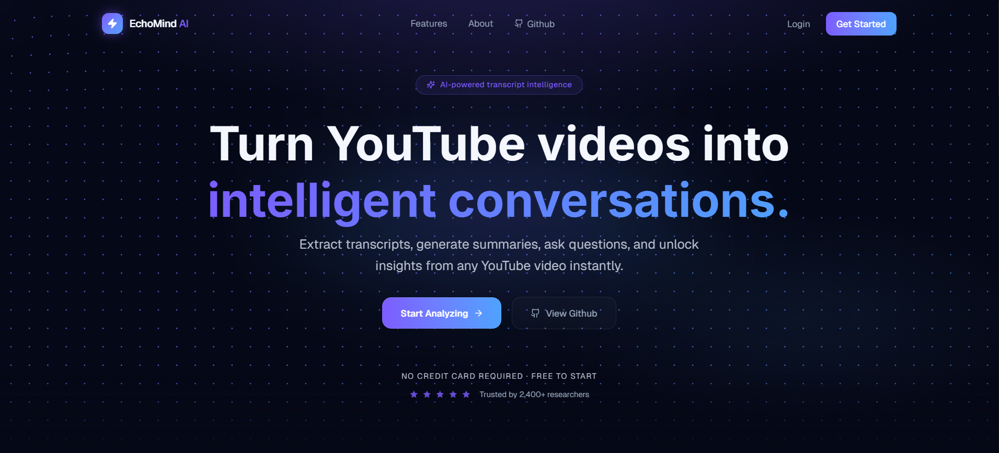
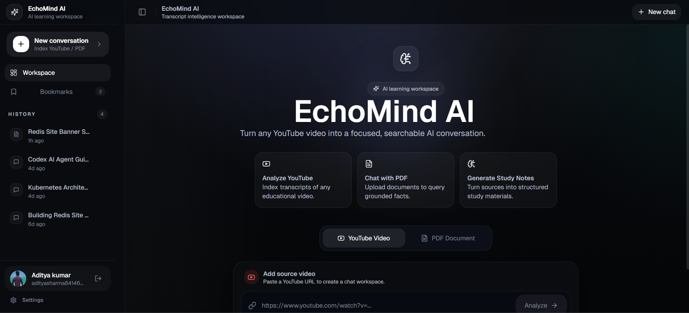

<div align="center">
  <h1>🧠 EchoMind AI</h1>
  <p><strong>YouTube Transcript Extractor & Conversational AI Assistant</strong></p>
  
  
  
  
  
  
</div>

<br />

**EchoMind AI** is a comprehensive, production-ready full-stack application that transforms how you interact with multimedia content. It allows you to automatically extract transcripts from YouTube videos, upload PDF documents, and leverage cutting-edge Conversational AI (powered by Google Gemini) to query, summarize, and explore your content interactively.

With a beautiful, responsive dark-mode UI, smooth animations, and a seamless hybrid authentication system, EchoMind AI provides a premium, robust user experience.

---

## 📸 Demo


| Dashboard Overview | Conversational AI Interface |
| :---: | :---: |
|  |  |

---

## 📑 Table of Contents
- [✨ Key Features](#-key-features)
- [🛠️ Tech Stack](#️-tech-stack)
- [⚙️ How It Works](#️-how-it-works)
- [🚀 Getting Started](#-getting-started)
- [🛡️ Security & Architecture](#️-security--architecture)
- [📄 License](#-license)

---

## ✨ Key Features

- **📺 YouTube Transcript Extraction:** Automatically fetch and parse rich transcripts from standard YouTube video URLs.
- **📄 PDF Document Processing:** Upload and parse PDFs for deep AI context integration and querying.
- **🤖 Conversational AI Assistant:** Ask questions and generate contextual summaries based on the extracted video text or uploaded documents.
- **🔐 Hybrid Authentication:** Secure manual (Email/Password) login paired with 1-click **Google OAuth 2.0**. Accounts are seamlessly and safely linked to prevent duplicates.
- **⚙️ Advanced Account Management:** Clean, safe, provider-aware settings modal and secure, password-validated account deletion.
- **🔖 Bookmark & Notes System:** Easily save specific AI responses, chats, and transcripts for future reference.
- **🎨 Premium UI/UX:** Built with Tailwind CSS and Framer Motion for a polished, glassmorphic dark-theme experience complete with smooth micro-animations.

---

## 🛠️ Tech Stack

### Frontend Architecture
- **Framework:** [React 19](https://react.dev/) + [TypeScript](https://www.typescriptlang.org/) bootstrapped with [Vite](https://vitejs.dev/)
- **Styling:** [Tailwind CSS v4](https://tailwindcss.com/), [Framer Motion](https://www.framer.com/motion/) for dynamic animations
- **State Management:** [Zustand](https://zustand-demo.pmnd.rs/) (Global state) + React Context API (Auth State)
- **Routing & Fetching:** [React Router v7](https://reactrouter.com/) and [TanStack React Query](https://tanstack.com/query/latest) (with Axios)
- **UI Components:** [Lucide React](https://lucide.dev/) icons, Radix UI primitives, and beautifully customized shadcn/ui components

### Backend Architecture
- **Server Environment:** [Node.js](https://nodejs.org/) & [Express.js](https://expressjs.com/) (TypeScript)
- **Database Layer:** [MongoDB](https://www.mongodb.com/) via [Mongoose](https://mongoosejs.com/) ORM
- **Authentication:** [Passport.js](https://www.passportjs.org/) (Google OAuth 2.0), JSON Web Tokens (JWT), and `bcrypt` for local encryption
- **AI & Integrations:** Google GenAI SDK (`@google/genai`) for conversational intelligence
- **Data Pipelines:** `youtube-transcript` (Video parsing), `multer` & `pdf-parse-new` (File processing)
- **Cloud Storage:** ImageKit integration for scalable asset hosting

---

## ⚙️ How It Works

1. **Input & Ingestion:** Users supply a YouTube URL or upload a PDF document.
2. **Parsing:** The Express backend intercepts the request, streams the document text, or extracts the YouTube transcript asynchronously.
3. **AI Contextualization:** The raw text is passed alongside user prompts to the Google Gemini AI model.
4. **Interactive Chat:** The frontend renders a chat-like interface where users can ask highly specific questions, request summaries, and brainstorm based on the initial material.
5. **Persistence:** Valuable chat messages and generated insights can be bookmarked and saved permanently to the user's secure account profile.

---

## 🚀 Getting Started

### Prerequisites

- Node.js (v18+)
- MongoDB (Local instance or MongoDB Atlas)
- Google Cloud Console Project (for OAuth 2.0 and Gemini API keys)
- ImageKit Account (for file storage)

### Installation

1. **Clone the repository**
   ```bash
   git clone https://github.com/your-username/EchoMind-AI.git
   cd EchoMind-AI
   ```

2. **Setup the Backend**
   ```bash
   cd backend
   npm install
   ```
   Create a `.env` file in the `backend/` directory:
   ```env
   PORT=5000
   MONGODB_URI=your_mongodb_connection_string
   ACCESS_TOKEN_SECRET=your_jwt_access_secret
   REFRESH_TOKEN_SECRET=your_jwt_refresh_secret
   ACCESS_TOKEN_EXPIRY=
   REFRESH_TOKEN_EXPIRY=
   GOOGLE_CLIENT_ID=your_google_client_id
   GOOGLE_CLIENT_SECRET=your_google_client_secret
   GOOGLE_CALLBACK_URL=
   GEMINI_API_KEY=your_google_genai_api_key
   IMAGEKIT_PUBLIC_KEY=your_imagekit_public_key
   IMAGEKIT_PRIVATE_KEY=your_imagekit_private_key
   IMAGEKIT_URL_ENDPOINT=your_imagekit_url_endpoint
   ```
   Run the backend development server:
   ```bash
   npm run dev
   ```

3. **Setup the Frontend**
   ```bash
   cd ../frontend
   npm install
   ```
   Create a `.env.local` file in the `frontend/` directory (if needed for Vite):
   ```env
   VITE_API_BASE_URL=http://localhost:8000
   ```
   Run the frontend development server:
   ```bash
   npm run dev
   ```

4. **Launch Application**
   Navigate to `http://localhost:5173` in your browser to start exploring EchoMind AI.

---

## 🛡️ Security & Architecture

- **Stateless & Stateful Auth:** Uses highly secure HTTP-only cookies for storing robust JWT access and refresh tokens.
- **Provider-Aware Logic:** The backend explicitly checks password existence rather than just the active provider type, ensuring hybrid accounts correctly prompt for a password when attempting to delete sensitive data.
- **Data Sanitization:** Utilizes `dompurify` to safely render markdown responses directly from the AI without introducing XSS vulnerabilities.

---

## 📄 License

This project is licensed under the ISC License.

---

<div align="center">
  <p>Built with ❤️ by <strong>Aditya</strong></p>
</div>
