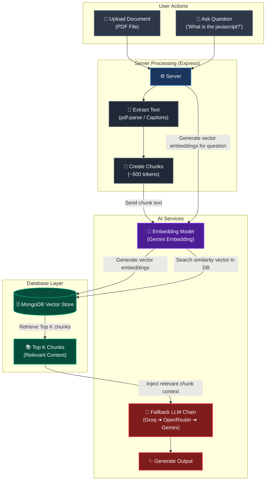
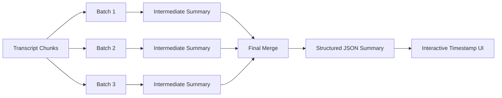

<div align="center">
  <h1>🧠 YouTube & PDF AI Assistant</h1>
  <p><strong>A production-oriented Retrieval-Augmented Generation (RAG) application for chatting with YouTube videos and PDF documents, featuring semantic search, hierarchical summarization, multi-model failover, and interactive citations.</strong></p>
  
  
  
  
  
  
</div>

<br />

This is a full-stack project designed to help you study and extract information from video transcripts and PDF documents. You paste a YouTube link or upload a PDF file, and the app will index the content and let you chat with it, ask questions, or generate structured study notes and summaries.

It has a responsive dark-mode interface, simple login/signup (including Google Login), and uses RAG (Retrieval-Augmented Generation) so the AI responses stay grounded in the video transcript or PDF text.

---

## 📑 Table of Contents
- [✨ Features](#-features)
- [🛠️ Tech Stack](#️-tech-stack)
- [🏗️ How the RAG Database works](#️-how-the-rag-database-works)
- [🤖 Multi-Model Fallback Architecture](#-multi-model-fallback-architecture)
- [🛡️ Secure Authentication Rate Limiting](#️-secure-authentication-rate-limiting)
- [🔄 Retries & Cooldown System](#-retries--cooldown-system)
- [🚀 Getting Started](#-getting-started)
- [🛡️ Security & Account Settings](#️-security--account-settings)
- [🧠 Hierarchical Summarization Architecture](#-hierarchical-summarization-architecture)
- [🧩 Prompt Architecture](#-prompt-architecture)
- [📄 License](#-license)

---

## ✨ Features

- **📺 YouTube Transcript Chat:** Paste any YouTube link, download its transcript, and ask questions. The AI replies and links back to the specific timestamp of the video.
- **▶️ In-App YouTube Player:** Watch the YouTube video directly alongside its transcript and your chat. Click on timestamp citations from the AI to jump straight to that moment in the video!
- **📄 Interactive Three-Panel PDF Workspace:** Upload a PDF file, index it, and view it in a premium 3-panel workspace:
  - **Left Panel:** Collapsible chat sidebar/navigation history.
  - **Center Panel:** Chat interface with auto-parsed interactive page citations (`📄 Page X`).
  - **Right Panel:** Sliding PDF context panel that opens directly to the cited page.
  - **Animations & Easing:** Dynamic spring-loaded transitions (powered by Framer Motion) that slide left/right matching the navigation direction.
  - **Responsive Layout:** Automatically scales the PDF canvas without blinking, and collapses into a bottom-sheet drawer on mobile viewports.
- **🤖 Multi-Model Fallback Architecture:** Never worry about rate limits or outages. The backend automatically cascades through multiple AI model providers (Groq ➔ OpenRouter ➔ Gemini) to guarantee seamless responses.
- **📝 AI Study Notes & Hierarchical Summaries:** Generate structured study notes and scalable summaries for YouTube videos and PDFs. Long videos are summarized       using a hierarchical multi-stage pipeline that overcomes LLM context window limitations while preserving chronological flow and interactive timestamps.
- **🧠 Hierarchical Summarization Pipeline:** Transcript chunks are grouped into configurable batches, summarized independently, and merged into a final structured summary. This architecture enables reliable summarization of significantly longer videos.
- **🌍 Language-Aware Summaries:** Summaries automatically adapt to the user's requested language. English is used by default, while Hindi or Hinglish summaries are generated only when explicitly requested.
- **🧩 Modular Prompt Architecture:** Separate prompt templates are maintained for Chat, Notes, PDF Notes, Intermediate Summaries, and Final Summaries, making the AI pipeline easier to maintain and extend.
- **🔐 Google & Local Login:** Log in using your email/password or use Google Sign-in. The app automatically links them if they share the same email.
- **🔖 Saved Bookmarks:** Bookmark specific AI answers or notes to find them later easily.
- **🔄 Auto-Retries & Cooldown:** If the AI embedding pipeline hits a rate limit, it automatically tries again in the background. If it fails 4 times, it locks for a 10-minute cooldown showing a countdown timer, then automatically unlocks so you can try again.
- **🔒 Deduplication:** If you upload the same PDF twice, the app detects its MD5 hash, opens your existing chat, and avoids duplicate storage or processing.
- **💬 Friendly Error Messages:** User messages are simple and friendly (no scary tech jargon or API error codes).
- **📊 Production-Grade Logging:** Uses Pino for ultra-fast, structured JSON logging in production and colorized, human-readable formatting in development.

---

## 🛠️ Tech Stack

### Frontend
- **Framework:** React 19 + TypeScript (built with Vite)
- **Styling:** Tailwind CSS v4 + Framer Motion for spring transitions
- **State Management:** Zustand (global states) + React Context (Auth State)
- **Routing & API:** React Router v7 + TanStack React Query (with Axios)
- **PDF Viewer:** `react-pdf` with hardware-accelerated CSS scaling and custom rendering

### Backend
- **Server:** Node.js + Express.js (TypeScript)
- **Database:** MongoDB + Mongoose ORM
- **Auth:** Passport.js (Google OAuth 2.0), JWT (JSON Web Tokens) in HttpOnly cookies, and bcrypt for passwords
- **AI Services & Fallback:** - **Groq SDK** (Llama 3 models)
- **OpenRouter SDK**
- **Google GenAI SDK** (`@google/genai`) with Gemini models
- **Parsing Pipelines:** `youtube-transcript` for video captions, `pdf-parse-new` for reading PDFs
- **Cloud Storage:** ImageKit to host uploaded PDFs
- **Logging:** Pino & Pino-Pretty (for structured, high-performance logging)

---

## 🏗️ How the RAG Database works

To keep database queries lightning-fast and avoid storing heavy arrays inside video or document metadata, the database is split into two layers:

1. **Metadata collections (`videos` & `pdfdocuments`):** Only store basic details like title, URL, chunk count, and loading statuses.
2. **Text Chunk collections (`transcriptchunks` & `pdfchunks`):** Store the actual text paragraphs, their order index, timestamps (start/end/duration), and 1536-dimension vectors for AI similarity search.

### 📊 RAG Flow & Architecture Diagram



---

### 🔄 Detailed RAG Pipelines

The Retrieval-Augmented Generation (RAG) system is divided into two decoupled pipelines:

#### 1. Ingestion & Indexing Pipeline (Document Upload or Transcript Download)
When you upload a PDF or import a YouTube video, the following background steps occur:
- **Text Extraction:** The backend extracts raw text content from the file (`pdf-parse-new` for documents) or downloads subtitles (`youtube-transcript` for videos).
- **Intelligent Chunking:** The extracted text is parsed and divided into overlapping chunks of approximately `500 tokens` with `100 tokens` of overlap (preventing loss of semantic context at boundary splits).
- **Embedding Generation:** For each text chunk, the server makes batched API requests to the Gemini Embedding model (`gemini-embedding-2`) to generate a **1536-dimensional vector embedding**.
- **Vector Storage:** The chunks, their page numbers or video timestamp indices, and their vector embeddings are stored as individual documents in `pdfchunks` or `transcriptchunks` collections in MongoDB.
- **Idempotency & Cleanup:** Before writing new chunks, any existing chunks matching the document ID are wiped (`deleteMany`) to prevent duplicate indexing upon manual retry.

#### 2. Query & Retrieval Pipeline (Chat Interaction)
When you ask a question about an indexed document or video transcript:
- **Vector Generation for Query:** The server sends your query text to the Gemini embedding service to generate its query vector.
- **Similarity Search:** The query vector is matched against the target document's chunks in MongoDB via Atlas Vector Search (using Cosine Similarity on the `embedding` fields).
- **Context Extraction:** The database returns the **Top K chunks** (default: 8) that have the highest similarity score matching the context of the user's question.
- **LLM Context Injection:** These relevant text chunks are formatted, combined with the recent chat history, and injected directly into the system prompt.
- **Cascading Generation:** The structured prompt is sent to the active LLM. If the primary provider fails, it seamlessly cascades through the fallback chain (**Groq ➔ OpenRouter ➔ Gemini**) to guarantee a response.

#### 3. Hierarchical Summarization Pipeline
Summary generation follows an independent AI pipeline separate from conversational retrieval.
1. Transcript chunks are grouped into configurable batches.
2. Each batch is summarized independently.
3. Intermediate summaries are generated in chronological order.
4. A second summarization stage merges all intermediate summaries.
5. The final response is returned as structured JSON while preserving interactive timestamps and frontend compatibility.

---

## 🧠 Hierarchical Summarization Architecture

Large Language Models have limited context windows, making it difficult to summarize long-form transcripts in a single request.

To overcome this limitation, EchoMind implements a **Hierarchical Summarization Pipeline**, allowing the application to summarize significantly longer YouTube videos while maintaining structured outputs and interactive timestamps.

### Architecture Flow



### Step 1 — Batch Formation

After transcript chunking, the chunks are grouped into configurable batches instead of sending the entire transcript to the LLM in one request.

Example:

```text
80 Transcript Chunks

↓

Batch 1 → Chunks 1–20

Batch 2 → Chunks 21–40

Batch 3 → Chunks 41–60

Batch 4 → Chunks 61–80
```

Each batch stays safely within the model's context window.

---

### Step 2 — Intermediate Summaries

Each batch is summarized independently.

The intermediate summaries preserve:

- chronological order
- technical concepts
- timestamp ranges
- contextual flow

---

### Step 3 — Final Merge

Instead of merging raw transcript chunks again, the application merges the intermediate summaries into one final structured response.

The final output preserves:

- interactive timestamps
- section headings
- chronological timeline
- frontend JSON compatibility

---

### Benefits

- Supports significantly longer YouTube videos.
- Prevents context window overflow.
- Produces cleaner and more structured summaries.
- Easily configurable through batch size settings.
- Future-ready architecture for larger documents and knowledge bases.


## 🤖 Multi-Model Fallback Architecture

To ensure high availability, the backend employs a fallback model chain:
1. **Fallback Chain Order:** `GroqProvider` ➔ `OpenRouterProvider` ➔ `GeminiProvider`.
2. **Health Monitoring:** If a provider fails (due to rate limits, API timeout, or authorization errors), it is dynamically marked **unhealthy** and placed on a **5-minute cooldown**.
3. **Seamless Handover:** The request is immediately passed to the next provider in the chain without failing the user's chat session.
4. **Reasoning Sanitization:** Automatically parses and strips out thinking/reasoning tags (`<think>`, `<thinking>`, and `<reasoning>`) from both text outputs and streaming responses to keep the chat interface clean and distraction-free.
5. **Shared AI Infrastructure:** The fallback architecture is shared across chat, notes, document analysis, and hierarchical summarization workflows, providing consistent reliability throughout the application.

---

## 🧩 Prompt Architecture

EchoMind uses a modular prompt architecture instead of maintaining a single monolithic prompt.

Dedicated prompt templates are maintained for:

- Chat
- Notes
- PDF Notes
- Intermediate Summaries
- Final Summaries

Language instructions are dynamically injected into every AI workflow, allowing the application to generate responses in English by default while supporting Hindi and Hinglish when explicitly requested.

This modular design improves maintainability and allows individual AI workflows to evolve independently without affecting the rest of the system.

---

## 🛡️ Secure Authentication Rate Limiting

To prevent brute-force attacks and user enumeration vulnerability:
- **Lockout Mechanism:** If an IP address registers 5 failed login attempts (either due to a non-existent email or incorrect password), it is locked out for **20 minutes**.
- **IP-Based Isolation:** Rate limiting is scoped strictly to the client IP address (`req.ip`), ensuring that blocking one client does not affect other users.
- **Backend Enforcement:** During the lockout period, all requests from the blocked IP are rejected early by the `authRateLimiterMiddleware` returning `429 Too Many Requests` with a `retryAfter` value representing remaining seconds.
- **DDoS/Brute-force Prevention:** Counter values are not incremented while the lockout is active.
- **Memory-Safe Cleanups:** The rate limiter uses an in-memory `Map` with automatic memory cleanup. Stale records are purged immediately on lockout expiration, successful login, or attempt resets, preventing memory leaks.
- **Synchronized Frontend Lockout UI:**
  - Synchronously initialized from `localStorage` to avoid any page-load flickering.
  - Dynamically disables inputs, form submissions, the Enter key, and displays a live countdown on the button: `Try again in MM:SS`.
  - Instantly synchronizes the locked state across all open browser tabs using the browser `storage` event.
  - Removes the client-side locked timestamp immediately after a successful authentication.

---

## 🔄 Retries & Cooldown System

To handle API failures or rate limits without breaking the app:
- **Attempts:** Up to 2 automatic attempts are run in the background. If those fail, you can click "Try again" manually up to 2 times (total of 4 attempts).
- **10-Minute Cooldown:** If the 4th attempt fails, the retry button gets disabled and shows a live countdown (e.g., `Try again later (9m 45s)`). The status says: `AI is temporarily unavailable. Please try again shortly.`
- **Auto Unlock:** Once the timer hits 0, the retry button automatically enables itself without a page refresh, letting you try again.
- **Idempotence:** Every retry wipes old incomplete chunks before inserting new ones to prevent duplicate database entries.

---

## 🚀 Getting Started

### Prerequisites
- Node.js (v18+)
- MongoDB (Local instance or MongoDB Atlas)
- Google Cloud Console credentials (for Google Login)
- Gemini API Key (from Google AI Studio)
- Groq API Key (from Groq Console)
- OpenRouter API Key
- ImageKit account (for PDF uploads)

### Setup Instructions

1. **Clone the project**
   ```bash
   git clone https://github.com/Adityamkumar/Yt_Ai_Transcript.git
   cd Yt_Ai_Transcript
   ```

2. **Backend Setup**
   ```bash
   cd backend
   npm install
   ```
   Create a `.env` file in the `backend/` folder:
   ```env
   PORT=8000
   MONGODB_URI=your_mongodb_connection_string
   ACCESS_TOKEN_SECRET=your_jwt_access_secret
   REFRESH_TOKEN_SECRET=your_jwt_refresh_secret
   ACCESS_TOKEN_EXPIRY=1h
   REFRESH_TOKEN_EXPIRY=7d
   GOOGLE_CLIENT_ID=your_google_client_id
   GOOGLE_CLIENT_SECRET=your_google_client_secret
   EMAIL_USER=your_gmail_address
   EMAIL_PASS=your_app_password
   GEMINI_API_KEY=your_gemini_api_key
   GROQ_API_KEY=your_groq_api_key
   OPENROUTER_API_KEY=your_openrouter_api_key
   IMAGEKIT_PUBLIC_KEY=your_imagekit_public_key
   IMAGEKIT_PRIVATE_KEY=your_imagekit_private_key
   IMAGEKIT_URL_ENDPOINT=your_imagekit_url_endpoint
   ```
   Start the backend:
   ```bash
   npm run dev
   ```

3. **Frontend Setup**
   ```bash
   cd ../frontend
   npm install
   ```
   Create a `.env.local` file in the `frontend/` folder:
   ```env
   VITE_API_BASE_URL=http://localhost:8000
   VITE_GOOGLE_CLIENT_ID=your_google_client_id
   ```
   *Note: Since the login flow is frontend-driven via Google Identity Services, you must also add your active client origins (like `http://localhost:5173` and your production URL) under the **Authorized JavaScript origins** list of your Google client credentials in Google Cloud Console.*
   Start the frontend:
   ```bash
   npm run dev
   ```

4. **MongoDB Vector Indexes Setup**
   If you are hosting on MongoDB Atlas, set up two vector search indexes:
   - Index named `pdfchunks_vector_index` on the `pdfchunks` collection for the `embedding` field (1536 dimensions, cosine similarity).
   - Index named `transcriptchunks_vector_index` on the `transcriptchunks` collection for the `embedding` field (1536 dimensions, cosine similarity).

5. **Open App**
   Open `http://localhost:5173` in your browser to start using the app.

---

## 🛡️ Security & Account Settings

- **Secure Login:** Session tokens are stored in secure HttpOnly cookies.
- **Refresh Token Rotation Race-Condition Prevention:** The Axios interceptor uses a locking flag (`isRefreshing`) and request queueing (`failedQueue`) to prevent duplicate concurrent refresh requests. This ensures seamless token renewal without accidental logouts when reloading pages with active parallel queries.
- **XSS Filter:** HTML tags in AI replies are sanitized using `dompurify` to prevent cross-site scripting.
- **Provider Checks:** Safe password checks are run on account deletion to make sure OAuth users can delete their profiles safely without errors.

---

## 📄 License

Licensed under the ISC License.

---

<div align="center">
  <p>Built with ❤️ by <strong>Aditya</strong></p>
</div>
